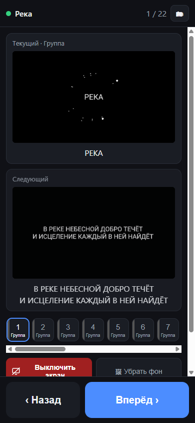
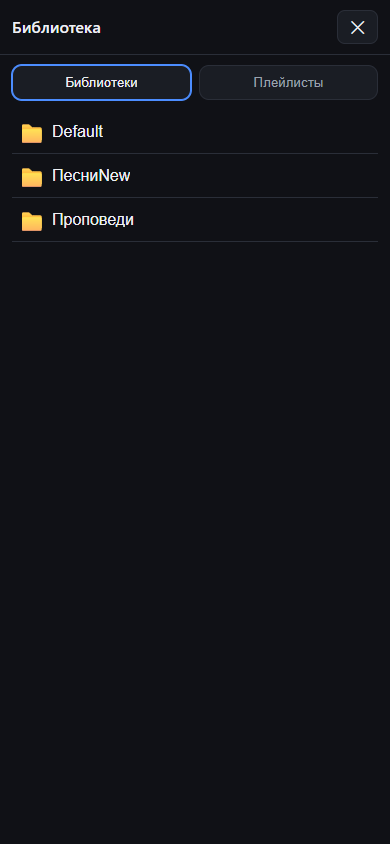

# ProPresenter Пульт

Веб-пульт для ProPresenter: открываешь на телефоне или планшете (iOS/Android) и видишь
текущий и следующий слайд (картинка + текст + заметки), переключаешь вперёд/назад,
прыгаешь на любой слайд, гасишь экран.




## Как это устроено

```
телефон/планшет (любой)  ──►  server.js на ПК с ProPresenter  ──►  ProPresenter API
   http://IP-ПК:8080            статика пульта + прокси /pp/*         127.0.0.1:50001
```

Почему мост, а не «PWA на GitHub Pages»: страница по HTTPS не имеет права ходить в
`http://192.168.x.x:50001` (mixed content + CORS) — браузер заблокирует. Поэтому пульт
раздаёт сам мост на твоей Wi-Fi сети: работает с любого устройства без установки,
даже без интернета.

## Запуск

### Вариант 1: готовый бинарник (без Node.js)

В [Releases](https://github.com/Saymon-J/ProPresentorPult/releases) лежат собранные
мосты: `pult.exe` (Windows) и `pult-darwin-arm64` / `pult-darwin-amd64` (macOS).
Веб-пульт вшит внутрь бинарника — больше ничего не нужно.

1. **ProPresenter** (7.9+ / 8 / 20): Настройки → Сеть → включить **Network** (API).
2. Запусти скачанный бинарник. macOS при первом запуске спросит про входящие
   подключения — разрешить; неподписанный бинарник открывается через
   правый клик → «Открыть».
3. Бинарник напечатает адреса вида `http://192.168.x.x:8080` — открой с телефона.
   Флаги те же: `-port 8080 -pp 127.0.0.1 -pp-port 50001,1025`
   (мост на другой машине: `-pp <IP-машины-с-ProPresenter>`).

### Вариант 2: Node.js

1. **ProPresenter** (7.9+ / 8 / 20): Настройки → Сеть → включить **Network** (API).
   Порт оставь стандартный (50001; в старых сборках 1025 — найдётся автоматически).
2. На этом же ПК:
   ```
   node server.js
   ```
3. Сервер напечатает адреса вида `http://192.168.x.x:8080` — открой любой на телефоне.
   Добавь на главный экран (iOS: Поделиться → «На экран “Домой”»; Android: меню →
   «Установить приложение») — откроется как отдельное приложение.

**Windows Firewall**: при первом запуске Windows спросит про доступ Node — разреши
для частных сетей. Иначе телефон не подключится.

**Демо без ProPresenter** (пощёлкать пультом): `node test/mock.js` в одном окне,
`node server.js` в другом.

**Проверка после изменений**: `node test/smoke.js` (14 проверок: статика, прокси,
переключения, миниатюры, затемнение, библиотеки, плейлисты, очистка, слои).

## Настройки

```
node server.js [--port 8080] [--pp 127.0.0.1] [--pp-port 50001,1025]
```

| Флаг | Что делает |
|---|---|
| `--port` | порт пульта (по умолчанию 8080) |
| `--pp` | адрес машины с ProPresenter, если мост на другом ПК |
| `--pp-port` | порты-кандидаты API ProPresenter |

## Что умеет пульт

- текущий слайд: миниатюра, текст, заметки, название группы (куплет/припев)
- следующий слайд: миниатюра и текст
- «Вперёд / Назад», переход на любой слайд по ленте внизу
- выбор презентации (🗂): библиотеки и плейлисты с миниатюрами, тап — запустить
- «Очистить слайд» не теряет колоду: пульт показывает позицию с бейджем «вне эфира»
- панель «Слои»: тумблеры Слайд (текст) / Фон-видео / Пропсы / Объявления / Сообщения /
  Видеовход (через текущий вид), кнопки настроенных видов (залов)
- затемнение экрана (все audience-выходы) и очистка слоя слайдов
- синхронизация: если слайд переключили с ПК или другого телефона — подтянется (~1 с)
- тёмная тема, крупные кнопки, PWA-манифест

## Ограничения

- Если в настройках сети ProPresenter задан пароль и API отвечает 403 — сними пароль
  (мост и так работает только внутри вашей Wi-Fi сети).
- Полноценный service worker (офлайн-кэш) регистрируется только по HTTPS/localhost;
  в локальной сети по http пульт работает, просто без офлайн-кэша — это нормально.
- Проверено против официальной OpenAPI-спецификации API v1 и мока; живой ProPresenter
  не исключает мелких отличий между версиями.

## Состав

- `server.js` — мост: статика + прозрачный прокси + автопоиск порта (Node ≥16, 0 зависимостей)
- `go/` — тот же мост на Go одним бинарником (UI вшит через go:embed);
  сборка: `go/build.cmd` (Windows) или `go/build.sh` (macOS/Linux, поддерживает
  кросс-сборку: `./build.sh darwin arm64`)
- `public/` — пульт (HTML/CSS/JS, манифест, иконки)
- `test/mock.js` — мок API ProPresenter (демо и тесты)
- `test/smoke.js` — smoke-тест
- `tools/gen-icons.js` — генератор иконок

## Источники

- Официальная спецификация API: <https://openapi.propresenter.com/> (swagger.json)
- Включение API: <https://support.renewedvision.com/hc/en-us/articles/31606866768147-TCP-IP-Connections-with-ProPresenter-API>
- Неофициальная документация протоколов Pro 7: <https://jeffmikels.github.io/ProPresenter-API/Pro7/>
